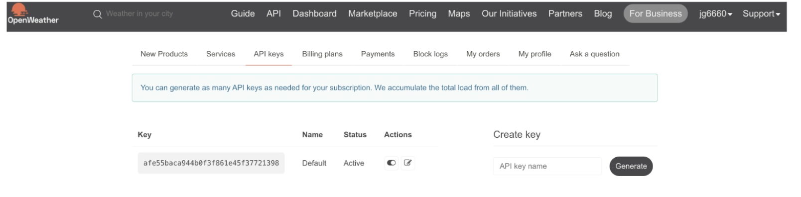
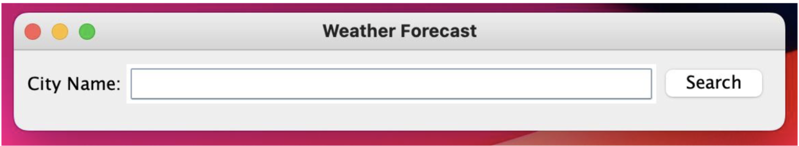
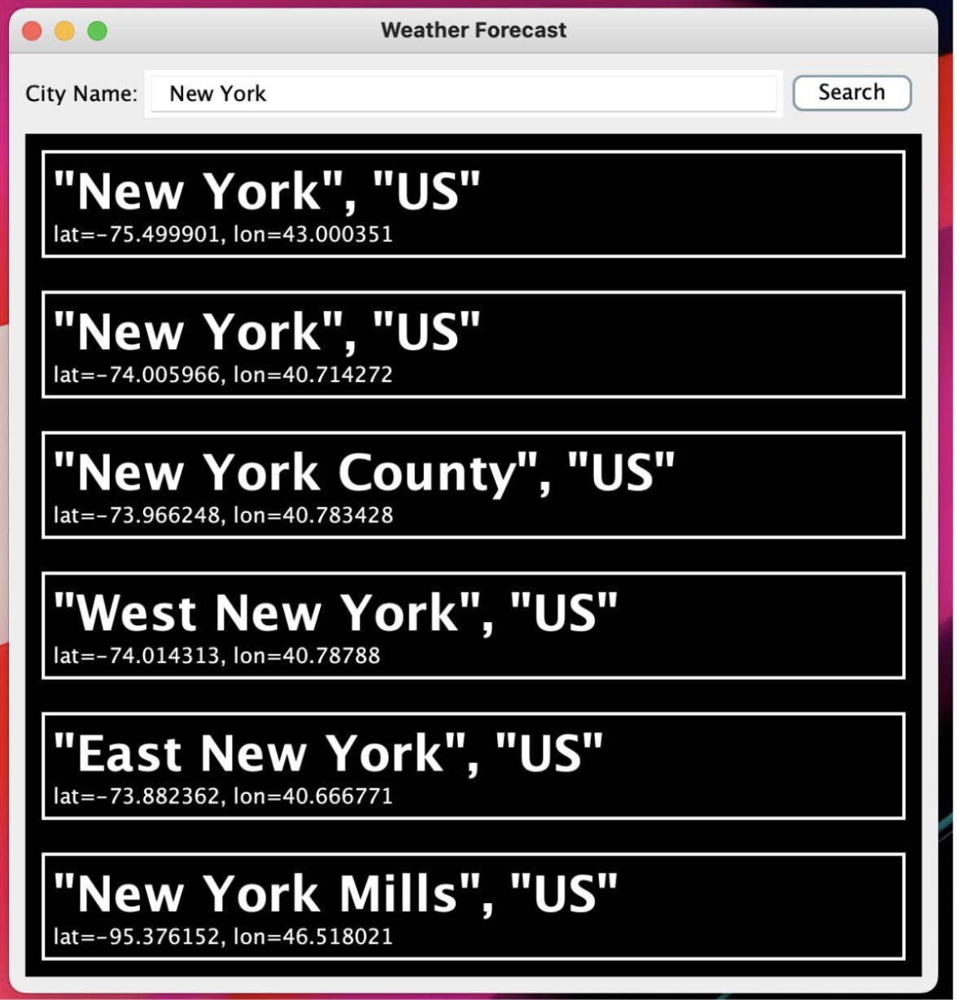
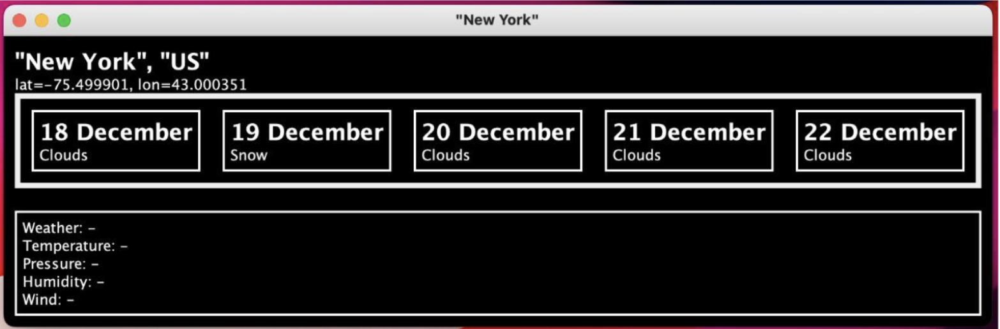
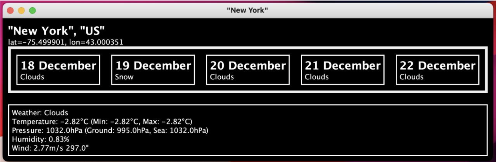

# Weather-Forecasting-Application

# Introduction to Java
CSGY 9053 Project Report
Submitted by:
Jaya Amit Sai Gurrala - jg6660
Paul Sannihith Reddy Singareddy - ps4351
Project Topic: Weather Forecasting App
Introduction:
Weather apps are primarily used to learn about local and global weather conditions. Thanks to the world wide web and local weather stations, the weather app on your devices can keep us up to date with the latest developments in global weather.
The project we are proposing will be a weather prediction application using java which will give the weather information for next week. We will be using an API which will give us the data which will be displayed. This includes temperature, humidity, pressure and wind. The user will be able to enter the location for which they want to view the weather.
The user will be able to enter the location in the search box and we will then fetch the weather details and display the forecast for the week in that place. We will fetch the city names that match the user input and the weather details using a get request.
 
 How to run the project:
● Download the zip file and extract to the desired location.
● Go to https://openweathermap.org/api
● Create your account and generate the API key.
● Copy the API key and paste it in OpenWeatherAPIConnection.java.
● Run the program as a JAVA application using Eclipse. Select the
weather-forecast-master.
● Enter the city name you want to search.
● Select the city.
● Select the date for which you want to see the weather.

 Technologies Used:
● Java Swing; GUI
● Rest API
● Event Handling
● Maven Dependencies
● JSON data

## Working

1. Extracting the API KEY

2. Searching city name

3. Listing out cities

4. Listing out dates

5. Displaying weather for given city and date

